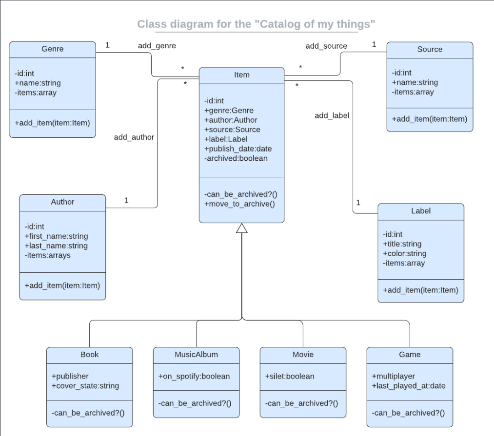

# Ruby-Capstone

> Catalog of my things

A console app that helps keep a record of different types of things won: books, music albums and games. Everything is based on the UML diagram presented below.
The data is stored in JSON files and database with tables structure analogical to the program's class structure.



## Built With

- Ruby

## Getting Started

To start using this software you need to have Ruby installed in your machine

Then clone this repo:

```
-$ git clone git@github.com:AyoubMs/catalog_of_my_things_ruby.git
```

```
-$ cd catalog_of_my_things_ruby
```

To run rspec, in your terminal for testing the methods:

```
-$ rspec
```

### Prerequisites

Ruby installed on your local machine

### Setup

- Clone the GitHub Repository
- Go to the Project Directory
- Run `bundle install`

### Usage

- Run `ruby ./main.rb` to start the app

## Authors

👤 **Ismail Courr**

- GitHub: [@ismailco](https://github.com/ismailco)
- GitHub: [@ismailcourr](https://twitter.com/ismailcourr)
- LinkedIn: [Ismail courr](https://www.linkedin.com/in/ismailcourr)

👤 **Akumu Bavon**

- GitHub: [@Bavon101](https://github.com/Bavon101)
- LinkedIn: [LinkedIn](https://www.linkedin.com/in/akumu-bavon-335416193/)

👤 **Muneeb Ul Rehman**

- GitHub: [@muneebulrehman](https://github.com/muneebulrehman)
- LinkedIn: [LinkedIn](https://www.linkedin.com/in/muneeb-ul-rehman-33903b159/)

## 🤝 Contributing

Contributions, issues, and feature requests are welcome!

Feel free to check the [issues page](../../issues/).

## Show your support

Give a ⭐️ if you like this project!

## 📝 License

This project is [MIT](./LICENSE) licensed.
